<div align="center">

# 🎯

# AI Resume Screening Portal

**Intelligent talent acquisition through advanced artificial intelligence**

[](https://opensource.org/licenses/MIT)
[](https://www.python.org/)
[](http://makeapullrequest.com)

[Features](#-core-capabilities) • [Installation](#-installation) • [Usage](#-how-it-works) • [Documentation](#-technology)

</div>

---

## 💎 Core Capabilities

<table>
<tr>
<td width="50%">

### 🧠 Intelligent Parsing
Extract meaningful insights from unstructured resume data using advanced NLP algorithms

</td>
<td width="50%">

### ⚡ Lightning Fast
Process hundreds of resumes in seconds with optimized parallel processing

</td>
</tr>
<tr>
<td width="50%">

### 🎨 Intuitive Interface
Elegant, minimal UI designed for seamless HR workflows

</td>
<td width="50%">

### 📊 Smart Analytics
Data-driven insights with visual candidate comparisons

</td>
</tr>
</table>

---

## 🚀 Installation

```bash
# Clone repository
git clone https://github.com/rishirai13/AI-Based-Resume-Screening-Portal.git

# Navigate to directory
cd AI-Based-Resume-Screening-Portal

# Install dependencies
pip install -r requirements.txt

# Launch application
python app.py
```

**→** Navigate to `http://localhost:5000`

---

## 🎬 How It Works

```mermaid
graph LR
    A[📤 Upload] --> B[🔍 Parse]
    B --> C[🧮 Analyze]
    C --> D[📈 Rank]
    D --> E[✅ Export]
```



<div align="center">

| Step | Action | Duration |
|:----:|--------|:--------:|
| **1** | Upload resumes (PDF/DOCX) | < 1s |
| **2** | Define screening criteria | 30s |
| **3** | AI processes & ranks candidates | 2-5s |
| **4** | Review intelligent matches | - |
| **5** | Export shortlisted profiles | < 1s |

</div>

---

## 🛠 Technology

```
┌─────────────────────────────────────────────┐
│  AI/ML Engine                               │
│  • Natural Language Processing              │
│  • Machine Learning Models                  │
│  • Semantic Analysis                        │
├─────────────────────────────────────────────┤
│  Backend Infrastructure                     │
│  • Python 3.8+ | Flask Framework            │
│  • PyPDF2 | python-docx                     │
├─────────────────────────────────────────────┤
│  Frontend Experience                        │
│  • Modern HTML5/CSS3                        │
│  • Vanilla JavaScript                       │
└─────────────────────────────────────────────┘
```

---

## 📐 Architecture

The system evaluates candidates across **five intelligence dimensions**:

<div align="center">

| Dimension | Weight | Description |
|-----------|:------:|-------------|
| **Technical Skills** | 30% | Programming languages, tools, frameworks |
| **Experience** | 25% | Years in role, industry exposure |
| **Education** | 20% | Degrees, certifications, institutions |
| **Keywords** | 15% | Domain-specific terminology |
| **Cultural Fit** | 10% | Soft skills, values alignment |

</div>

---

## ⚙️ Configuration

Customize screening parameters:

```python
# config.py
SCREENING_CONFIG = {
    'file_formats': ['pdf', 'docx'],
    'max_file_size': 5 * 1024 * 1024,  # 5MB
    'match_threshold': 0.75,
    'batch_size': 50,
    'ai_model': 'advanced_nlp_v2'
}
```

---

## 🎯 Advanced Features

<details>
<summary><b>🔐 Secure Processing</b></summary>
<br>
End-to-end encryption with automatic data purging after analysis
</details>

<details>
<summary><b>🌐 Multi-language Support</b></summary>
<br>
Analyze resumes in 20+ languages with intelligent translation
</details>

<details>
<summary><b>📱 API Access</b></summary>
<br>
RESTful API for seamless integration with existing HR systems
</details>

<details>
<summary><b>🔄 Continuous Learning</b></summary>
<br>
AI model improves accuracy through feedback loops
</details>

---

## 🤝 Contributing

We welcome contributions from the community!

```bash
# Create feature branch
git checkout -b feature/amazing-feature

# Commit changes
git commit -m '✨ Add amazing feature'

# Push to branch
git push origin feature/amazing-feature

# Open Pull Request
```

**Please read** [CONTRIBUTING.md](CONTRIBUTING.md) for guidelines.

---

## 📜 License

This project is licensed under the **MIT License** — see [LICENSE](LICENSE) for details.

---

## 👨‍💻 Author

<div align="center">

**Rishi Rai**

[](https://github.com/rishirai13)

*Building the future of recruitment, one algorithm at a time*

</div>

---

<div align="center">

### 🌟 Star History

[](https://star-history.com/#rishirai13/AI-Based-Resume-Screening-Portal&Date)

---

**If this project helps your hiring process, please consider giving it a ⭐**

Made with 💙 by developers, for developers

[⬆ Back to Top](#-ai-resume-screening-portal)

</div>
